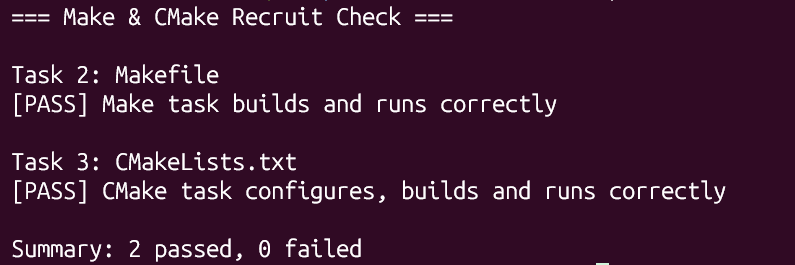

# Task 4：思考题

## 1. Make 和简单的 build.sh 有什么区别？

+ 简单的build.sh是按写好的顺序全量执行所有命令，哪怕只改了一个文件，也会从头跑完所有编译步骤，没有智能判断；而Make是靠Makefile里定义的「目标-依赖」规则，自动比对文件修改时间戳，只重新编译改动过的部分，大项目里能省大量重复编译时间。

## 2. CMake 是编译器吗？

执行 `cmake --build build` 时，最终是谁在编译 C 源文件？

+ CMake 不是编译器‌。它是一个构建自动化工具，核心能力是解析 Makefile 里定义的依赖规则，判断哪些源文件需要重新处理，然后自动执行对应的编译、链接命令，本身不具备把 C 源码翻译成机器码的能力。
+ 执行 cmake --build build 时，最终真正编译 C 源文件的是底层原生编译器，也就是GCC

## 3. 为什么不希望每次都重新编译所有 `.c` 文件？

最核心的原因是‌大幅降低开发迭代的时间成本‌。

一个中等规模的C语言项目往往包含数十甚至上百个源文件，全量编译一次可能耗时数分钟。如果每次修改一行代码都要重新编译全部文件，开发效率会极低。

